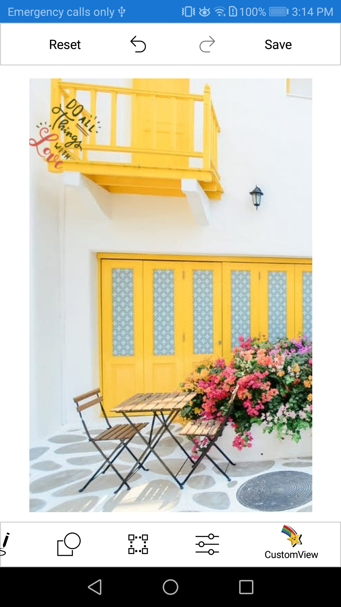

# How-to-add-custom-view-with-bounds-in-Xamarin-SfImageEditor-

This article explains how to add a custom view with bounds and rotatable elements in the Xamarin.Forms SfImageEditor control.

Step 1: Create an SfImageEditor sample with all the necessary assemblies.

Refer to this [Getting started](https://help.syncfusion.com/xamarin/image-editor/getting-started) documentation to create a simple SfImageEditor sample and configure it.

Step 2: Set the RotatableElements property to ImageEditorElements.CustomView to rotate and resize the CustomView, and add custom FooterToolbarItem using the Text and Icon properties with SubItems. 

[XAML]

```
            imageEditor.RotatableElements = ImageEditorElements.CustomView;
            var footerToolbarItem = new FooterToolbarItem() { Icon = ImageSource.FromResource("IE_Sample.Icons.ITypogy3.png"), Text = "CustomView" };
            footerToolbarItem.SubItems = new ObservableCollection<Syncfusion.SfImageEditor.XForms.ToolbarItem>()
            {
                new Syncfusion.SfImageEditor.XForms.ToolbarItem() { Name = "CustomView1", Icon = ImageSource.FromResource("IE_Sample.Icons.ITypogy1.png") ,Text="ITypogy1" },
                new Syncfusion.SfImageEditor.XForms.ToolbarItem() { Name = "CustomView2", Icon = ImageSource.FromResource("IE_Sample.Icons.ITypogy2.png") ,Text="ITypogy2" }
 
            };
            imageEditor.ToolbarSettings.ToolbarItems.Add(footerToolbarItem);

```            

Step 3: Get the respective toolbar items as an argument using the ToolbarItemSelected event.

[C#]

```
        imageEditor.ToolbarSettings.ToolbarItemSelected += ToolbarSettings_ToolbarItemSelected;

        ...

        private void ToolbarSettings_ToolbarItemSelected(object sender, ToolbarItemSelectedEventArgs e)
        {
            if (e.ToolbarItem.Name == "CustomView1")
            {
 
                AddCustomView(e.ToolbarItem.Text);
            }
            if (e.ToolbarItem.Name == "CustomView2")
            {
                AddCustomView(e.ToolbarItem.Text);
 
            }
 
        }
``` 
 
Step 4: Add a custom view to an image using the AddCustomView method in the ImageEditor control. Specify a custom view with bounds as demonstrated in the following code snippet.

[C#]

```
        private void AddCustomView(string imageName)
        {
            var sampleName = "IE_Sample.Icons." + imageName + ".png";
            Image customImage = new Image();
            customImage.Source = ImageSource.FromResource(sampleName);
            imageEditor.AddCustomView(customImage, new CustomViewSettings() { Bounds = new Rectangle(0, 0, 25, 25), CanMaintainAspectRatio = true, Angle = 45 });
        }
```

# Output


 
# See also

[How do I add a shape to an image](https://help.syncfusion.com/xamarin/image-editor/shapes)

[How do I notify the image that is loaded in the SfImageEditor control](https://help.syncfusion.com/xamarin/image-editor/save?_ga=2.38198627.1114957439.1600059253-1193986663.1587573160#imageloaded-event)

[How can I customize the appearance of the shape](https://help.syncfusion.com/xamarin/image-editor/shapes?_ga=2.145592436.1114957439.1600059253-1193986663.1587573160#customizing-a-shape-with-pen-settings)
